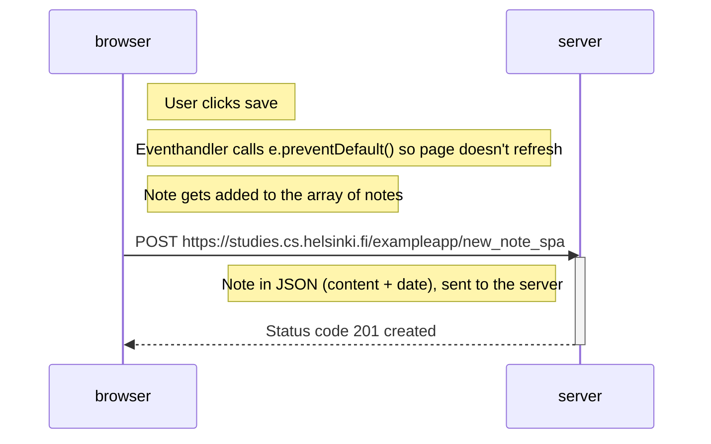

```mermaid
sequenceDiagram
    participant browser
    participant server
    
    Note right of browser: User clicks save
    Note right of browser: Eventhandler calls e.preventDefault() so page doesn't refresh
    Note right of browser: Note gets added to the array of notes
    browser->>server: POST https://studies.cs.helsinki.fi/exampleapp/new_note_spa
    activate server
    Note left of server: Note in JSON (content + date),  sent to the server
    server-->>browser: Status code 201 created
    deactivate server

```
